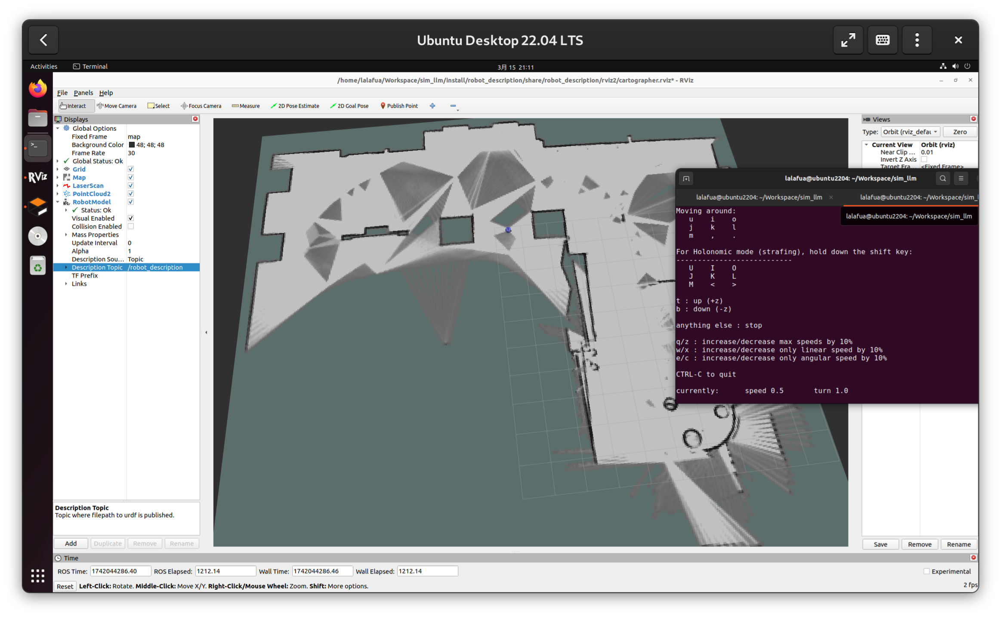

# 本周工作（3.10 ~ 3.17）

- 由于原来功能包中提供的 xbot urdf 关系比较杂乱，因此自己建模清晰表达，优化 tf 树，减少不必要的功能，[Commit 08927f4](https://github.com/lalafua/sim_llm/commit/08927f4324a0d1947db81fad6724e0f5acb447b4)

- 使用 Cartographer 系列功能包完成建图，[Commit 62761ce](https://github.com/lalafua/sim_llm/commit/62761cecf44a62b2cc18f9955b5678eb47500627)

- 添加 nav2 导航功能包，并跑通了简单的导航服务，
[Commit 37ac9ff](https://github.com/lalafua/sim_llm/commit/37ac9ff74110607814f9fc79936a92a7b4b2db54)