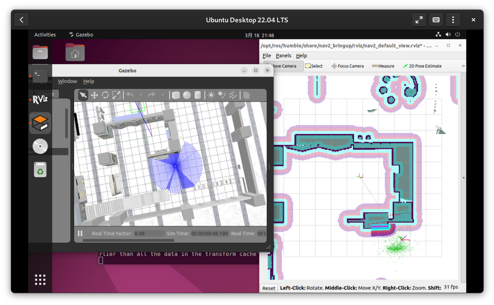

# 本周工作（3.17 ~ 3.24）

- 跑通各个功能的测试脚本，包括导航指令传递、错误处理以及 TF 坐标变换监听 [Commit c5d46de](https://github.com/lalafua/sim_llm/commit/c5d46de6774ce13b59210861f92e058b27684cac)

- 基本完成代码的移植工作（主要是从 ROS1 到 ROS2 的功能包切换），所有功能已全部跑通，[Commit 28ff11d](https://github.com/lalafua/sim_llm/commit/28ff11ded28a7dcd49bf2e4443dfa504265d92a8) 。相较于 ROS1 的实现有如下变动：
    - urdf 建模自己实现
    - 建图使用 Cartographer ( ROS1 中采用的是 Gmapping )  
    - 导航服务器使用 Nav2 bring_up，导航控制使用 Nav2 BasicNavigator（ ROS1 中采用的是 map_server 和 move_base ）
