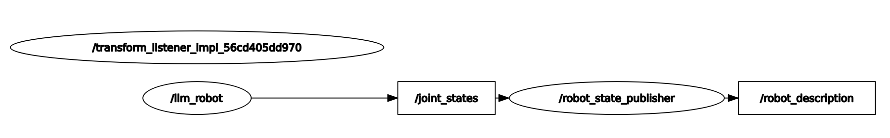

# 2025年1月工作报告

## ROS

### sim_llm
是一个基于 ROS2 的仿真测试，结合 DeepSeek Api、yolov8n，控制 turtlesim_node 完成一些简单的行动。

- 仓库链接：https://github.com/lalafua/sim_llm
- 演示视频：https://github.com/lalafua/sim_llm/tree/main/assets/demo.gif
- 节点关系：https://github.com/lalafua/sim_llm/blob/main/assets/rosgraph.png

项目要点：
- 通过合适的 prompt 引导 AI 将自然语言转换为计算机可以直接处理的 json 字符串。
    - prompt 设置
    ```
    prompt: Hello DeepseekV3! You will receive a text command from a robot. You need to convert it to a json string in plain text.
    prompt: find the plastic bottle.
        answer:{
            "commands":[
                {
                    "command": "find",
                    "parms":{
                        "goal":"plastic bottle"
                    }
                }
            ]
        }
    prompt: pick up the red boll.
        answer:{
            "commands":[
                {
                    "command": "pick_up",
                    "parms":{
                        "goal":"red boll"
                    }
                }
            ]
        }
    prompt: pick up my phone and close the door.
        answer:{
            "commands":[
                {
                    "command": "pick_up",
                    "parms":{
                        "goal": "hat"
                    }
                },
                {
                    "command": "close",
                    "parms":{
                        "goal": "door"
                    }
                }
            ]
        }
    ```
    - 效果展示
    

    - 服务端采用 key-value 的形式解析执行对应的命令
    ```python
        def parser_map(self, cmd):
        """
        parser the command from 'llm_nlp' node, then control the turtlebot
        Args:
            cmd (str): json string from nlp node
        Returns:
            None
        """

        commands = json.loads(cmd)["commands"]
        # print(commands) 
        command_map = {
            "find": lambda parms : self.find(parms["goal"])
        }
        for item in commands:
            command = item["command"]
            parms = item["parms"]
            if command in command_map:
                command_map[command](parms)
            else:
                self.get_logger().error("Command {} not found.".format(command))
    ```

- 使用 46 张数据集训练 yolo 模型用于对象检测。
    - 工作空间地址：https://app.roboflow.com/buildmyownx/bottle-fviyh/visualize/2

### 学习
- 正在学习 ROS Gazebo Urdf 建模仿真以及 Rviz 数据可视化，准备把 sim_llm 仿真使用的 turtlesim 替换为 Gazebo。
    - 学习文档地址：https://fishros.com/d2lros2/#/humble/chapt8/get_started/2.RVIZ2%E5%8F%AF%E8%A7%86%E5%8C%96URDF%E6%A8%A1%E5%9E%8B
    
    - 目前已经通过 Rviz 将建模数据，TF 坐标变换数据可视化处理，
    过程展示：
    节点关系：

- 正在学习 C++，后续希望把核心代码部分用 C++ 重写，提高运行速度。
    - 学习书籍：C++ Prime Plus 第六版（Stephen Prata 著）