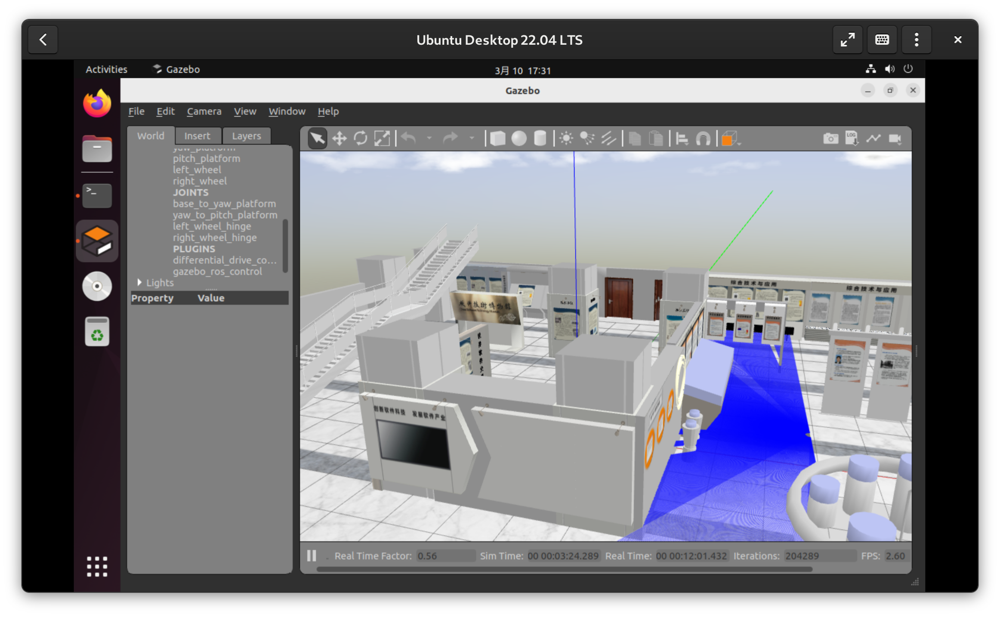

# 本周工作 （3.3 ~ 3.10）

- QEMU 启动 OpenEuler Riscv64 并跑通 ROS2 Humble 的 turtlesim 例程

- 尝试移植 ISCAS 的建模仿真包，当前进度：
    - 顶层控制部分的代码已经移植完毕，由于建模仿真依赖的包从 ROS1 Noetic 到 ROS2 Humble 变动较大，存在大量冲突，正在逐一排查尝试解决，测试尚未进行
    - [robot_sim_demo](https://github.com/lalafua/sim_llm/tree/ROS1/src/robot_sim_demo) 部分移植完成，但是机器人模型无法正常显示，且 TF 树发布存在问题。
    